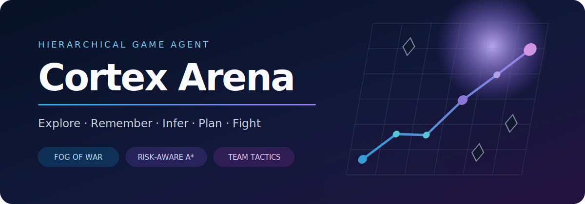
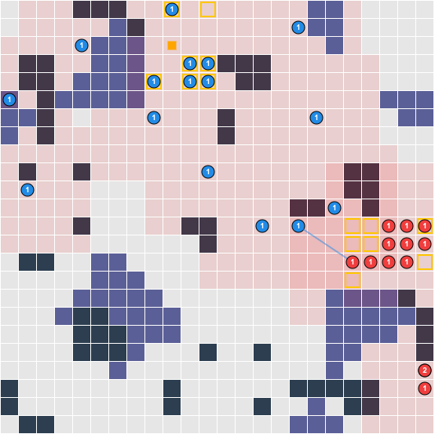
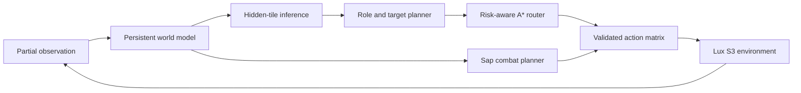

<div align="center">
  
</div>

<div align="center">
  
  <br>
  <sub>Actual seed-42 replay, frame 253/505, rendered by the official Lux S3 visualizer. Blue: Cortex Arena; red: starter baseline.</sub>
</div>

<div align="center">

[](https://github.com/bihraint-oss/cortex-arena/actions/workflows/ci.yml)
[](https://www.python.org/)
[](LICENSE)
[](https://github.com/Lux-AI-Challenge/Lux-Design-S3)

**A reproducible game agent that explores, remembers, plans, and fights in a real strategy environment.**

[中文](README.zh-CN.md) · [Architecture](docs/architecture.md) · [Research notes](docs/research.md)

</div>

## Why this project exists

Game-agent demos often fall into one of two traps: they depend on an abandoned research environment, or they automate a commercial game in a way that is difficult to reproduce and may violate platform rules. Cortex Arena takes a narrower, testable route.

It plays [Lux AI Challenge Season 3](https://github.com/Lux-AI-Challenge/Lux-Design-S3), an Apache-2.0 strategy environment with fog of war, simultaneous actions, persistent maps, randomized mechanics, exploration, resource management, hidden scoring tiles, and ranged combat. A match produces a browser replay, so the policy can be watched rather than judged from a single score.

Cortex Arena is not a renamed starter bot. Its strategy is split into independent perception, inference, planning, routing, and combat components that can be tested without launching the full game.

## What the agent does

- **Reasons through fog of war.** Relics, visits, objective beliefs, and opponent tracks persist across the five-match episode; drift-sensitive terrain and energy are trusted only in the current observation.
- **Uses map symmetry.** Every reliable observation updates the corresponding anti-diagonal tile, doubling useful information without cheating.
- **Infers hidden objectives.** Point deltas and distinct unit positions are used to identify which relic-adjacent tiles actually score.
- **Allocates explainable roles.** Ships become scouts, prospectors, harvesters, interceptors, or rechargers according to the current belief state.
- **Routes around risk.** A* treats asteroids as blocked and prices unknown space, nebulae, negative energy fields, and visible opponents separately.
- **Avoids wasteful combat.** The sap planner prioritizes stacks, weak ships, and enemies contesting possible scoring tiles instead of firing at every sighting.



## Quick start

The project supports Python 3.11–3.13 on Linux and macOS. [`uv`](https://docs.astral.sh/uv/) is recommended because it installs the exact locked environment.

```bash
git clone https://github.com/bihraint-oss/cortex-arena.git
cd cortex-arena
uv sync --locked --extra dev
uv run cortex-arena doctor
```

Run Cortex Arena against the bundled deterministic baseline and generate an interactive replay:

```bash
uv run cortex-arena play --seed 42 --output replays/cortex-vs-starter.html
```

Then open `replays/cortex-vs-starter.html` in a browser. The replay shell is local; the official Lux visualizer JavaScript is loaded from `s3vis.lux-ai.org`.

To open the live game renderer as the agents play:

```bash
uv run cortex-arena play --seed 42 --render
```

## Reproducible evaluation

`benchmark` alternates player sides, advances deterministic seeds, and stores every episode result in JSON:

```bash
uv run cortex-arena benchmark \
  --games 10 \
  --seed 100 \
  --output benchmark-results.json
```

The bundled opponent is intentionally small and transparent; it is a smoke-test baseline, not a claim of leaderboard strength. See [the evaluation guide](docs/evaluation.md) before comparing changes.

### Verified v0.1.0 smoke benchmark

| Environment | Seeds | Side policy | Result | Match wins |
|---|---:|---|---:|---:|
| `luxai-s3==0.2.1` | 100–109 | alternated every game | **10 W / 0 L** | **44–6** |

This run completed on Apple Silicon with Python 3.13.12 in 48.8 seconds. The machine-readable record is committed at [`reports/baseline-v0.1.0.json`](reports/baseline-v0.1.0.json). These numbers establish protocol and strategy regressions against the bundled baseline only; they do not imply competition-leaderboard strength.

## Kaggle-compatible bundle

The same tested policy can be packaged behind the official line-oriented agent protocol:

```bash
uv run cortex-arena build-submission
```

This writes `dist/cortex-arena-submission.tar.gz` with `main.py`, the strategy package, and license notices at the expected archive root.

## Project structure

```text
.
├── main.py                    # Lux/Kaggle process entry point
├── src/cortex_arena/
│   ├── world.py               # fog memory + hidden objective inference
│   ├── planner.py             # role and target allocation
│   ├── pathfinding.py         # risk-aware A*
│   ├── combat.py              # coordinated sap targeting
│   ├── agent.py               # bounded decision loop
│   └── cli.py                 # replay, benchmark, doctor, packaging
├── opponents/starter/main.py  # deterministic local baseline
├── tests/                     # unit tests with synthetic observations
└── docs/                      # architecture, research, and evaluation notes
```

## Design boundaries

This repository controls only the open, local Lux simulation API. It does **not** capture arbitrary windows, inject input, read process memory, bypass anti-cheat, or automate online/competitive accounts. The architecture can later gain another explicitly permitted environment adapter, but commercial-game automation is outside the default scope.

The next serious adapter candidate is the official HTTP reinforcement-learning interface in [0 A.D. Release 28](https://gitea.wildfiregames.com/0ad/0ad/wiki/GettingStartedReinforcementLearning), which would preserve the same offline and reproducible boundary while moving to a full RTS.

## Status and roadmap

Cortex Arena is an engineering baseline, not a pretrained foundation model.

- [x] Persistent partial-observation world model
- [x] Symmetry completion and hidden scoring-tile inference
- [x] Hierarchical role assignment, A*, and coordinated combat
- [x] Browser replay, seeded benchmark, tests, CI, and submission builder
- [ ] Opponent motion prediction and mechanics-system identification
- [ ] Search or offline-RL policy for tactical action selection
- [ ] Tournament adapters for community agents
- [ ] 0 A.D. R28 HTTP environment adapter

## Attribution and license

Original Cortex Arena code is available under the [MIT License](LICENSE). The separately installed Lux AI Season 3 environment is maintained by the Lux AI Challenge authors and licensed under Apache-2.0. It is not vendored here. See [NOTICE](NOTICE) for details.
